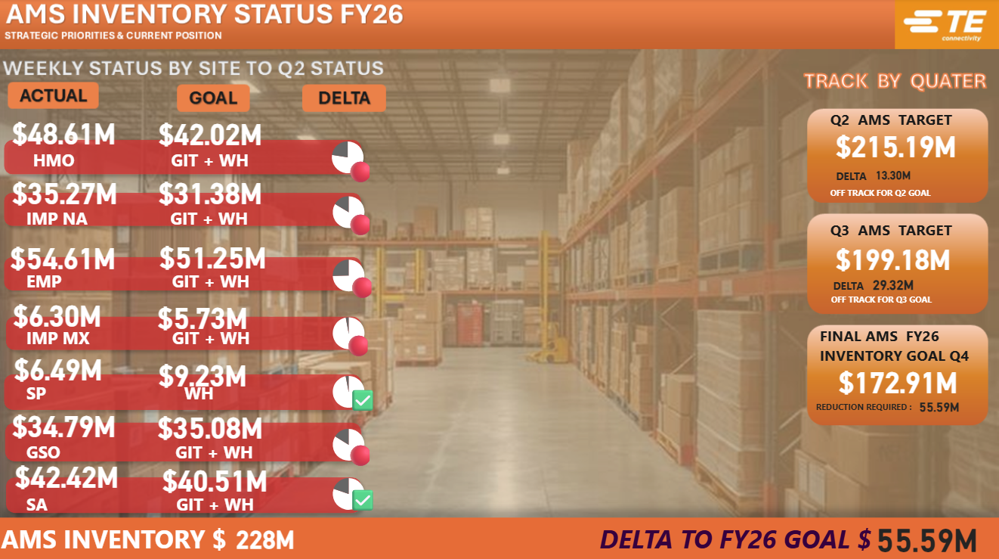
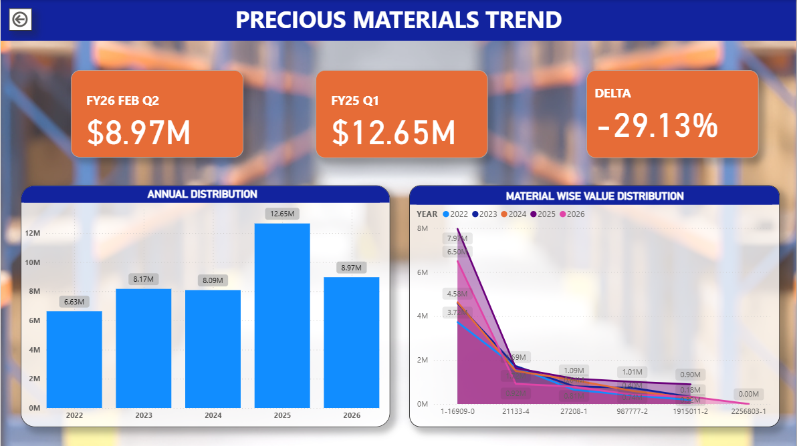
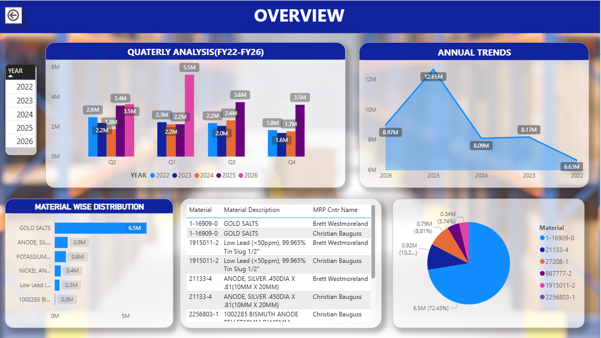
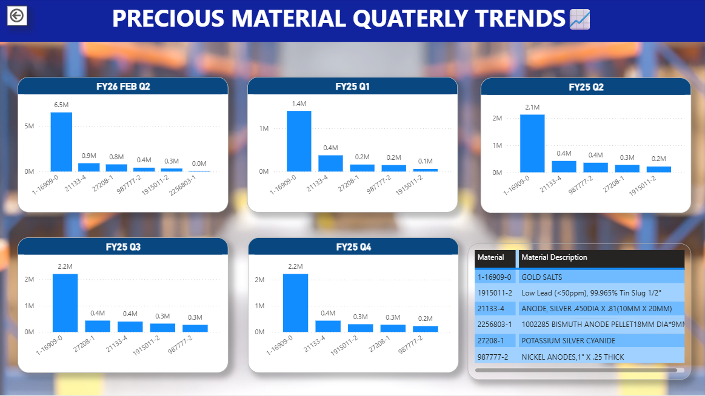

## Data Flow
 
[Raw Data Folder] → [Power Query] → [Processed File] → [Dashboard]
 
## Dashboard Preview
 

## Data Flow
 
[Raw Data Folder] → [Power Query] → [Processed File] → [Dashboard]

## Dashboard Preview
 

